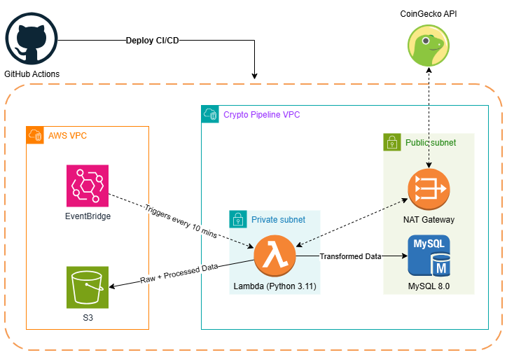

# 💰 Crypto Price Pipeline

An automated ETL pipeline that extracts real-time cryptocurrency prices from the CoinGecko API, stores raw data in Amazon S3, and loads transformed data into an RDS MySQL database — fully deployed on AWS using Terraform and automated via GitHub Actions.

---

## 🏗️ Architecture



---

## 🛠️ Tech Stack

| Layer | Technology |
|---|---|
| Language | Python 3.11, Terraform |
| Compute | AWS Lambda |
| Database | AWS RDS MySQL 8.0 |
| Storage | AWS S3 |
| Networking | AWS VPC, Private Subnets, NAT Gateway |
| Security | AWS IAM, Security Groups |
| Scheduling | AWS EventBridge |
| CI/CD | GitHub Actions |

---

## 📁 Project Structure

```
Crypto_Price_Pipeline/
├── .github/
│   └── workflows/
│       └── [deploy.yaml](.github/workflows/deploy.yaml)                  # CI/CD pipeline
├── schema/
│   └── [Crypto_Pipeline_Schema.png](docs/Crypto_Pipeline_Schema.png)   # Architecture diagram
├── src/
│   ├── [main.py](src/main.py)                                            # Lambda handler + orchestration
│   ├── [extract.py](src/extract.py)                                      # CoinGecko API extraction
│   ├── [transform.py](src/transform.py)                                  # Data transformation
│   ├── [load.py](src/load.py)                                            # S3 and RDS loading
│   └── [conn.py](src/conn.py)                                            # RDS connection management
├── terraform/
│   ├── [main.tf](terraform/main.tf)                                      # Terraform backend + provider
│   ├── [vpc.tf](terraform/vpc.tf)                                        # VPC module
│   ├── [lambda.tf](terraform/lambda.tf)                                  # Lambda function
│   ├── [rds.tf](terraform/rds.tf)                                        # RDS instance
│   ├── [s3.tf](terraform/s3.tf)                                          # S3 bucket
│   ├── [iam.tf](terraform/iam.tf)                                        # IAM roles and policies
│   ├── [sg.tf](terraform/sg.tf)                                          # Security groups
│   ├── [eventbridge.tf](terraform/eventbridge.tf)                        # EventBridge schedule
│   └── [variables.tf](terraform/variables.tf)                            # Input variables
├── [.gitattributes](.gitattributes)
└── [.gitignore](.gitignore)
```

---

## ☁️ AWS Infrastructure

### Networking
- VPC with public and private subnets across 3 Availability Zones
- Lambda deployed in **private subnets** with NAT Gateway for outbound internet access
- RDS deployed in public subnets (dev) — planned migration to private subnets with bastion host

### Security
- Lambda and RDS in separate Security Groups
- Inbound MySQL access restricted to VPC CIDR (`10.0.0.0/16`)
- IAM roles follow least-privilege principle
- Credentials managed via environment variables and GitHub Secrets

### Automation
- EventBridge rule triggers Lambda every 10 minutes
- Full infrastructure deployed and updated via GitHub Actions on push to `main`

---

## 🔄 CI/CD Flow

```
Push to main
    │
    ├── Terraform Apply (VPC, S3, RDS, IAM, Security Groups)
    ├── pip install + zip Lambda package
    ├── Upload zip to S3
    └── Terraform Apply (Lambda + EventBridge)
```

---

## ⚙️ Setup

### Prerequisites
- AWS account with programatic access
- Terraform >= 1.5.0
- Python 3.11

### Steps

**1. Create a GitHub repository and clone it locally**
```bash
git clone https://github.com/guibarriosa/Crypto_Price_Pipeline
cd .\Crypto_Price_Pipeline
```

**2. Create an S3 bucket manually in AWS for Terraform state**

This bucket stores the Terraform state file and must exist before the first deploy. Create it via the AWS console or CLI:
```bash
aws s3api create-bucket --bucket "<your-tfstate-bucket>" --region us-east-1
```

Then update `terraform/main.tf` with your bucket name:
```hcl
backend "s3" {
  bucket = "<your-tfstate-bucket>"
  key    = "terraform/terraform.tfstate"
  region = "us-east-1"
}
```

**3. Update the following files with your own S3 bucket for data save**

| File | What to change |
|---|---|
| `terraform/s3.tf` | Your S3 crypto bucket name (must be globally unique) |
| `terraform/iam.tf` | S3 bucket ARN in the inline policy |
| `src/load.py` | `BUCKET_NAME` at the top of the file |

**4. Add the following secrets to your GitHub repository**

Settings → Secrets and variables → Actions → New repository secret

| Secret | Description |
|---|---|
| `AWS_ACCESS_KEY_ID` | AWS access key |
| `AWS_SECRET_ACCESS_KEY` | AWS secret key |
| `DB_PASSWORD` | RDS master password |
| `DB_USER` | RDS master username |
| `DB_NAME` | Database name |
| `MY_IP` | Your IP for direct RDS access (CIDR format, e.g. `1.2.3.4/32`) |

**5. Push to main**

GitHub Actions handles the full deployment automatically.

---

## 🚧 Future Improvements

- [ ] Migrate RDS to private subnets with bastion host
- [ ] Add CloudWatch alarms and SNS notifications for pipeline failures
- [ ] Add data visualisation dashboard
- [ ] Implement AWS Glue for more complex transformations